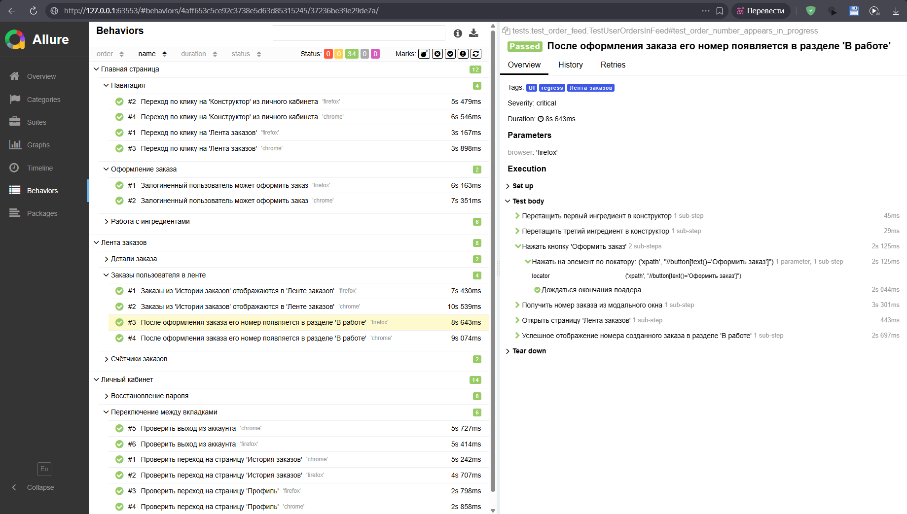

# Stellar Burgers — UI автотесты

Проект UI-автотестирования сервиса [Stellar Burgers](https://stellarburgers.education-services.ru).
Реализован на Python с использованием Selenium WebDriver, паттерна Page Object Model, pytest и Allure.

---

## Отчёт Allure



34 теста, все прошли. Покрыты три раздела: Главная страница, Лента заказов, Личный кабинет.

---

## Стек

| Инструмент | Назначение                           |
|------------|--------------------------------------|
| Python 3.x | Язык реализации                      |
| Selenium   | Управление браузером                 |
| pytest     | Фреймворк для запуска тестов         |
| Allure     | Отчётность                           |
| requests   | API-вызовы (создание/удаление юзера) |

---

## Структура проекта

```
Task_3/
├── conftest.py                   # Фикстуры: browser, main_page, user_is_auth, created_order и др.
├── constants.py                  # URL и эндпоинты
│
├── helpers/
│   ├── api_client.py             # create_user / delete_user через API
│   └── build_user.py             # Генерация данных тестового пользователя
│
├── locators/
│   ├── header_locators.py
│   ├── main_page_locators.py
│   ├── order_feed_page_locators.py
│   ├── account_profile_page_locators.py
│   ├── login_page_locators.py
│   ├── forgot_password_page_locators.py
│   └── reset_password_page_locators.py
│
├── pages/
│   ├── base_page.py              # Базовый класс: клики, ожидания, drag-and-drop
│   ├── main_page.py
│   ├── order_feed_page.py
│   ├── account_profile_page.py
│   ├── login_page.py
│   ├── forgot_password_page.py
│   └── reset_password_page.py
│
├── tests/
│   ├── test_main_page.py         # Главная страница
│   ├── test_order_feed.py        # Лента заказов
│   ├── test_personal_account.py  # Личный кабинет
│   └── test_password_recovery.py # Восстановление пароля
│
└── utlis/
    └── attach.py                 # Скриншот при падении теста
```

---

## Покрытие тестами

### Главная страница (`test_main_page.py`)

| Тест | Описание |
|------|----------|
| `test_redirect_to_constructor_from_account` | Переход по клику на «Конструктор» из личного кабинета |
| `test_redirect_to_order_feed_from_account` | Переход по клику на «Лента заказов» |
| `test_ingredient_modal_appears_on_click` | Клик на ингредиент открывает модальное окно с деталями |
| `test_ingredient_counter_increases_on_add` | При добавлении ингредиента увеличивается счётчик |
| `test_ingredient_modal_closes_on_close_button` | Закрытие модального окна кликом по крестику |
| `test_authenticated_user_can_place_order` | Залогиненный пользователь может оформить заказ |

### Лента заказов (`test_order_feed.py`)

| Тест | Описание |
|------|----------|
| `test_order_details_modal_appears_on_click` | Клик на заказ открывает всплывающее окно с деталями |
| `test_counters_increase_after_order` | Счётчики «за всё время» и «за сегодня» увеличиваются после создания заказа |
| `test_orders_from_history_appear_in_feed` | Заказы из «Истории заказов» отображаются в «Ленте заказов» |
| `test_order_number_appears_in_progress` | После оформления заказа его номер появляется в разделе «В работе» |

### Личный кабинет (`test_personal_account.py`)

| Тест | Описание |
|------|----------|
| `test_redirect_to_personal_account` | Переход на страницу «Профиль» с отображением данных пользователя |
| `test_redirect_to_order_history` | Переход на страницу «История заказов» |
| `test_logout` | Выход из аккаунта |

### Восстановление пароля (`test_password_recovery.py`)

| Тест | Описание |
|------|----------|
| `test_redirect_to_login_page_by_login_button` | Отображение ссылки «Восстановить пароль» на странице логина |
| `test_redirect_to_forgot_password_page_by_text_link` | Переход на страницу восстановления пароля |
| `test_send_email_and_redirect_to_send_new_password` | Ввод почты и переход к вводу нового пароля |
| `test_toggle_password_visibility_by_eye_icon` | Отображение/скрытие пароля по иконке «глаз» |

---

## Установка и запуск

### 1. Установить зависимости

```bash
pip install -r requirements.txt
```

### 2. Запустить тесты

```bash
# Все тесты (Firefox + Chrome)
pytest tests/

# Только один браузер
pytest tests/ -k "firefox"
pytest tests/ -k "chrome"

# Конкретный файл
pytest tests/test_order_feed.py
```

### 3. Открыть Allure-отчёт

```bash
allure serve allure-result
```

